# Sistem Pengelolaan Data Narapidana        

## 📌 Identitas
- **Nama** : Rivalio Chendra
- **NIM**  : 2509116039
- **Praktikum** : Pemrograman Berorientasi Objek
- **Kelas** : A

---
 
## 📖 Deskripsi Program
 
Sistem Pengelolaan Data Narapidana merupakan program yang digunakan untuk mengelola data narapidana dalam sebuah lembaga pemasyarakatan. Program ini memungkinkan admin untuk menyimpan, menampilkan, mengubah, dan menghapus data narapidana melalui menu yang tersedia.

### Data yang Dikelola

| Data | Keterangan |
|---|---|
| ID Narapidana | Identitas unik setiap narapidana |
| Nama | Nama narapidana |
| Kasus | Kasus atau tindak pidana yang dilakukan |
| Masa Tahanan | Lama masa tahanan dalam bulan |
| Nomor Sel | Nomor sel tempat narapidana ditempatkan |
| Blok Sel | Blok tempat sel narapidana berada |

Program memiliki beberapa kategori narapidana. Setiap kategori memiliki informasi tambahan yang berbeda sesuai dengan jenis kasusnya.

### Kategori Narapidana

| Kategori | Informasi Tambahan |
|---|---|
| Narkotika | Jenis rehabilitasi |
| Terorisme | Tingkat risiko |
| Korupsi | Uang pengganti |
| Pembunuhan | Kategori pembunuhan |
| Pencurian | Nilai kerugian |

### Fitur Program

| Menu | Fungsi |
|---|---|
| Tampilkan Narapidana | Menampilkan seluruh data narapidana yang tersimpan |
| Tambah Narapidana | Menambahkan data narapidana baru sesuai kategori |
| Update Nomor Sel | Mengubah nomor sel berdasarkan ID narapidana |
| Hapus Narapidana | Menghapus data narapidana berdasarkan ID |
| Keluar | Mengakhiri program |

---  


## 🗂️ Struktur Project   MVC
Program menggunakan struktur MVC (Model-View-Controller) untuk memisahkan bagian data, tampilan, dan pengelolaan proses program. Berikut adalah struktur package program:    

```
Lapas [main]
└── Source Packages
    │
    ├── com.mycompany.lapas
    │   └── Main.java
    │
    ├── controller
    │   └── AdminLapas.java
    │
    ├── model
    │   ├── Narapidana.java
    │   ├── NarapidanaKorupsi.java
    │   ├── NarapidanaNarkotika.java
    │   ├── NarapidanaPembunuhan.java
    │   ├── NarapidanaPencurian.java
    │   └── NarapidanaTerorisme.java
    │
    └── view
        └── NarapidanaView.java
```


| Lapisan | Isi | File |
|---|---|---|
| **Model** | Atribut, constructor, getter/setter, method `getInfo()` yang mengembalikan `String` (tidak mencetak apa pun) | `Narapidana.java` dan 5 subclass-nya |
| **View** | Seluruh `System.out.println`/`print`, `Scanner`, dan validasi input | `NarapidanaView.java` |
| **Controller** | `ArrayList`, logika CRUD, memanggil Model dan View | `AdminLapas.java` |
| **Main** | Titik awal program, membuat objek, mengisi dummy data, menjalankan menu | `Main.java` |

```java
// Model — hanya mengembalikan String, TIDAK mencetak apa pun
public String getInfo() {
    return "ID Narapidana : " + idNapi + "...";
}
```
```java
// View — satu-satunya tempat yang mencetak ke layar
public void tampilkanNarapidana(Narapidana n) {
    System.out.println(n.getInfo());
    System.out.println("------------------------------------------");
}
```

Dengan pemisahan ini, jika tampilan program ingin diubah, cukup ubah `NarapidanaView.java` tanpa perlu menyentuh logika CRUD di `AdminLapas.java`, maupun struktur data di `Narapidana.java`.

---

## 🔄 Alur Program   

1. Program dimulai dari `main()` di class `Main`. Objek `Scanner`, `NarapidanaView`, dan `AdminLapas` dibuat, lalu 5 data awal (satu untuk tiap kategori kejahatan) dimasukkan ke `ArrayList` melalui method `tambahDataAwal()`.
2. Program masuk ke perulangan `while` yang terus menampilkan menu dan menerima pilihan pengguna, sampai pengguna memilih menu Keluar.
3. Setiap pilihan menu (1–5) diarahkan lewat percabangan `switch` ke method yang sesuai di `AdminLapas`:
   - **Tampilkan**: menampilkan seluruh data dengan perulangan `for`.
   - **Tambah**: menanyakan kategori kejahatan (submenu 1–5) terlebih dahulu, lalu membuat objek dari subclass yang sesuai.
   - **Update**: mencari data berdasarkan ID, lalu mengubah nomor selnya.
   - **Hapus**: mencari data berdasarkan ID, lalu menghapusnya dari `ArrayList`.
4. Untuk fitur Update dan Hapus, pencarian data menggunakan `boolean ditemukan`. Jika ID tidak ditemukan, pesan error ditampilkan tanpa menghentikan program.
5. Seluruh input divalidasi terlebih dahulu di `NarapidanaView` sebelum diproses (lihat tabel validasi di bawah).
6. Program terus berulang sampai pengguna memilih menu Keluar, yang mengubah `berjalan` menjadi `false` dan menghentikan perulangan `while`.

### Validasi Input

| No | Validasi | Pesan yang Ditampilkan |
|----|----------|------------------------|
| 1 | ID/Nama/Kasus tidak boleh kosong | "... tidak boleh kosong, coba lagi." |
| 2 | ID tidak boleh sama dengan data yang sudah ada | "ID sudah digunakan, data batal ditambahkan." |
| 3 | Kategori kejahatan harus 1–5 | "Kategori tidak valid, data batal ditambahkan." |
| 4 | Input angka tidak boleh berupa huruf/teks | "Input harus berupa angka, coba lagi." |
| 5 | Angka (masa tahanan, uang pengganti, dll) harus lebih besar dari 0 | "Angka harus lebih besar dari 0, coba lagi." |

Validasi angka menggunakan `scanner.hasNextInt()`/`hasNextLong()` di dalam perulangan `while`, sehingga program tidak berhenti (crash) meskipun pengguna salah memasukkan tipe data.

---

## 🔐 Penerapan Encapsulation dan Inheritance
### Encapsulation

Seluruh atribut pada class `Narapidana` dideklarasikan dengan modifier **`private`**, sehingga tidak dapat diakses langsung dari class lain. Akses hanya bisa dilakukan melalui method `public` berupa getter dan setter.

```java
public class Narapidana {
    private String idNapi;
    private String nama;
    private String kasus;
    private int masaTahanan;
    private String nomorSel;
    private String blokSel;

    public String getIdNapi() {
        return idNapi;
    }

    public void setNomorSel(String nomorSel) {
        this.nomorSel = nomorSel;
    }
    // getter dan setter lainnya...
}
```

Dengan cara ini, `AdminLapas` (Controller) tidak pernah menulis `n.idNapi = "..."` secara langsung, melainkan selalu melalui `n.getIdNapi()` atau `n.setNomorSel(...)`, sehingga data tidak dapat diubah secara sembarangan dari luar class-nya.

### Inheritance

Program menerapkan inheritance dengan **1 superclass** (`Narapidana`) dan **5 subclass**, satu untuk setiap kategori kejahatan:

```text
                         ┌───────────────────────────┐
                         │ Narapidana (Superclass)   │
                         ├───────────────────────────┤
                         │ - idNapi                  │
                         │ - nama                    │
                         │ - kasus                   │
                         │ - masaTahanan             │
                         │ - nomorSel                │
                         │ - blokSel                 │
                         └───────────────────────────┘
                                       │
                                     extends
                                       │
        ┌──────────────────────────────┼───────────────────────────────────┐
        │                │             │                  │                │
        │                │             │                  │                │
┌───────┴───────┐ ┌──────┴───────┐ ┌───┴────────┐ ┌───────┴───────┐ ┌──────┴───────┐
│ Narkotika     │ │ Terorisme    │ │ Korupsi    │ │ Pembunuhan    │ │ Pencurian    │
│ (Subclass)    │ │ (Subclass)   │ │ (Subclass) │ │ (Subclass)    │ │ (Subclass)   │
├───────────────┤ ├──────────────┤ ├────────────┤ ├───────────────┤ ├──────────────┤
│ +jenis        │ │ +tingkat     │ │ +uang      │ │ +kategori     │ │ +nilai       │
│  Rehabilitasi │ │  Risiko      │ │  Pengganti │ │  Pembunuhan   │ │  Kerugian    │
└───────────────┘ └──────────────┘ └────────────┘ └───────────────┘ └──────────────┘
```

**Contoh subclass, `NarapidanaKorupsi`:**
```java
public class NarapidanaKorupsi extends Narapidana {
    private long uangPengganti;

    public NarapidanaKorupsi(String idNapi, String nama, String kasus, int masaTahanan,
                              String nomorSel, String blokSel, long uangPengganti) {
        super(idNapi, nama, kasus, masaTahanan, nomorSel, blokSel); // memanggil constructor superclass
        this.uangPengganti = uangPengganti;
    }
}
```

Setiap subclass mewarisi seluruh atribut umum dari `Narapidana`, lalu menambahkan satu atribut khusus yang hanya relevan untuk kategori kejahatannya. Ini menghindari pemaksaan atribut yang tidak relevan ke seluruh narapidana — misalnya, "Uang Pengganti" hanya bermakna untuk kasus Korupsi, bukan Pencurian.

---   

## 🧩 Penerapan Polymorphism

### Polymorphism (Method Overriding)

Method `getInfo()` pada `Narapidana` **di-override** oleh setiap subclass untuk menambahkan informasi khusus kategorinya:

```java
// Superclass
public String getInfo() {
        return "ID Narapidana : " + idNapi + "\n"...
}

// Subclass NarapidanaKorupsi
@Override
public String getInfo() {
    return super.getInfo() + "\n" + "Uang Pengganti: Rp" + uangPengganti + "\n"
            + "Kategori      : KORUPSI";
}
```

Manfaatnya terlihat pada `AdminLapas`, yang menyimpan seluruh data dalam satu `ArrayList<Narapidana>` walaupun isinya campuran objek dari 5 subclass berbeda:

```java
private ArrayList<Narapidana> daftarNarapidana;

public void tampilkanNarapidana() {
    for (Narapidana n : daftarNarapidana) {
        view.tampilkanNarapidana(n); // memanggil n.getInfo()
    }
}
```

Java secara otomatis memanggil `getInfo()` sesuai jenis objek aslinya, jika objeknya `NarapidanaKorupsi`, yang terpanggil adalah `getInfo()` versi `NarapidanaKorupsi`, bukan versi `Narapidana`. Controller tidak perlu memeriksa satu per satu jenis objeknya; cukup memanggil `getInfo()` dan Java yang menentukan versi mana yang dijalankan.

---

## 🖼️ Dokumentasi Hasil Uji Coba Program   
### 1. Tampilan Menu Utama     
**1. Menu Utama**
 
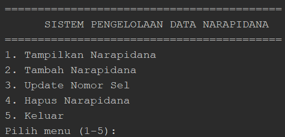
 
Tampilan awal saat program dijalankan, menampilkan 5 pilihan menu. Lima data awal (satu untuk tiap kategori kejahatan) sudah dimuat secara otomatis.
 <br> <br>

**2. Tampilkan Narapidana**
 
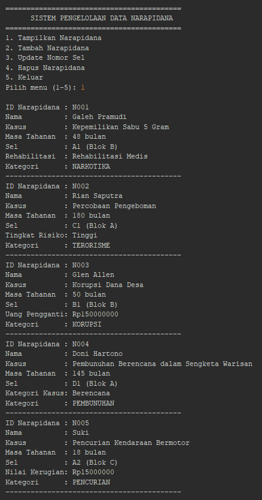
 
Hasil dari menu nomor 1: seluruh data narapidana ditampilkan dalam format kartu, dengan atribut tambahan yang berbeda sesuai kategorinya masing-masing.
  <br> <br>

**3. Tambah Narapidana**
 
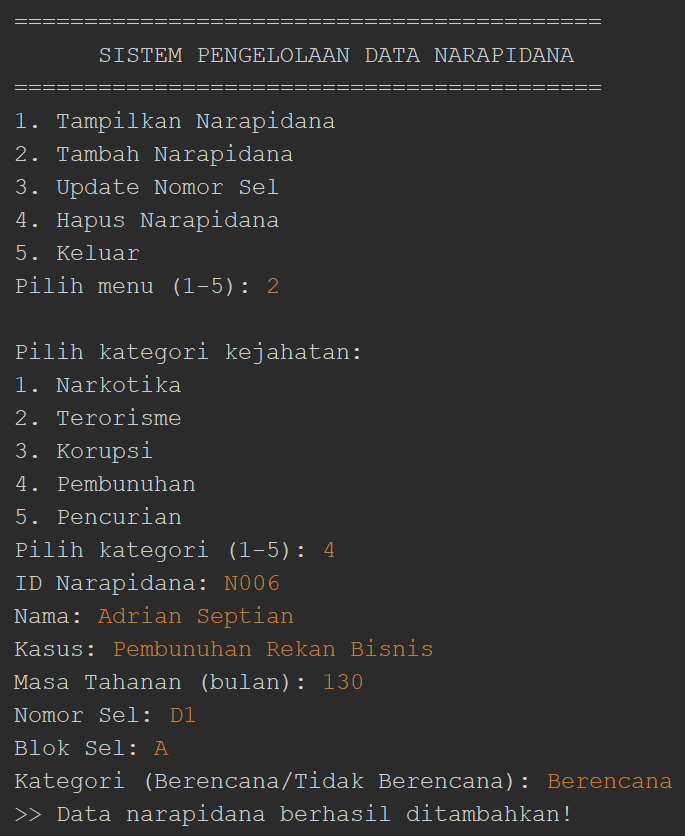
 
Setelah memilih menu Tambah, program menanyakan kategori kejahatan terlebih dahulu untuk menentukan subclass mana yang akan dibuat. Proses input data narapidana baru: ID, Nama, Kasus, Masa Tahanan, Nomor Sel, Blok Sel, dan satu atribut tambahan sesuai kategori yang dipilih.
  <br> <br>

**5. Update Nomor Sel**
 
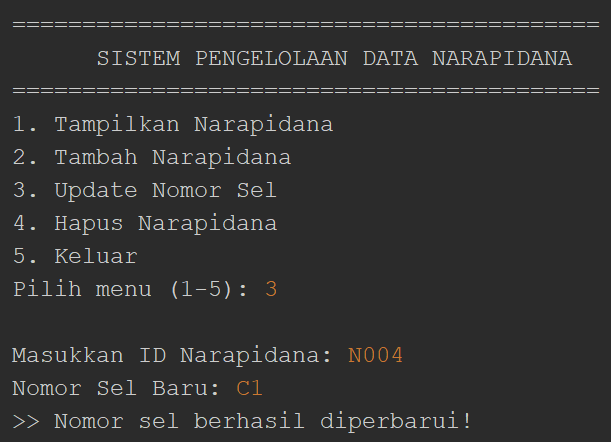
 
Proses pembaruan nomor sel, program mencari data berdasarkan ID yang dimasukkan, lalu memperbarui nomor selnya.
  <br> <br>

**6. Hapus Narapidana**
 
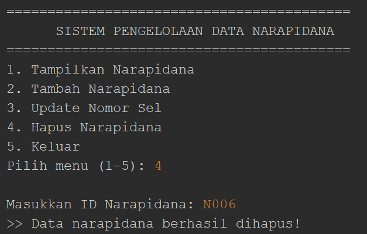
 
Proses penghapusan data berdasarkan ID yang dimasukkan.
  <br> <br>

**7. Keluar**
 
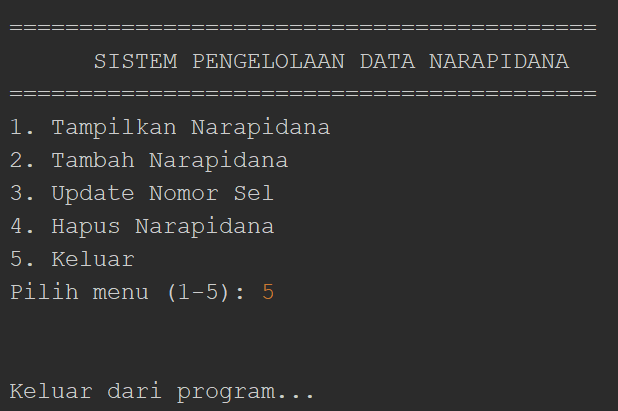
 
Pesan penutup yang muncul saat memilih menu Keluar.
  <br> <br>

**8. Validasi Input Kosong**
 
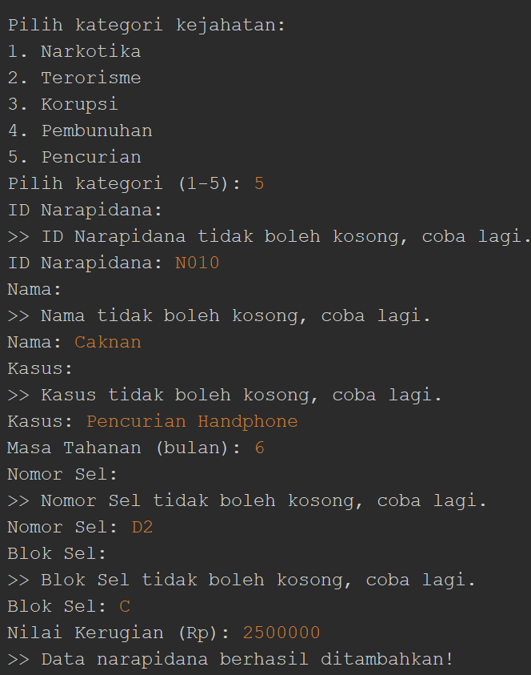
 
Pesan error saat kolom seperti ID/Nama/Kasus dibiarkan kosong.
  <br> <br>

**9. Validasi ID Duplikat**
 
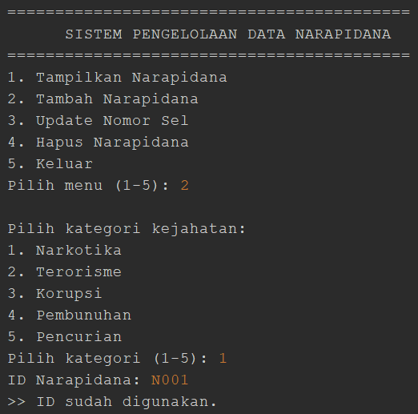
 
Pesan error saat ID yang dimasukkan sudah digunakan narapidana lain.
  <br> <br>

**10. Validasi Kategori Tidak Valid**
 
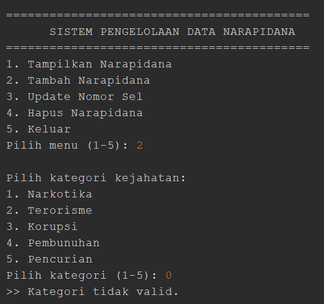
 
Pesan error saat kategori kejahatan dipilih di luar angka 1–5.
 <br> <br>

**11. Validasi Input Bukan Angka**
 
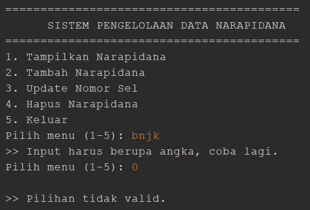
 
Pesan error saat kolom yang seharusnya diisi angka justru diisi huruf/teks.
  <br> <br>

**12. Validasi Angka Harus Positif**
 
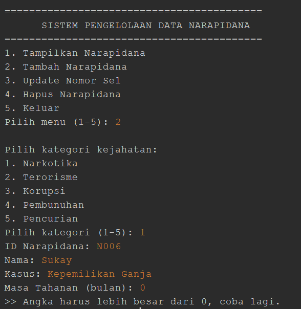
 
Pesan error saat angka yang dimasukkan bernilai 0 atau negatif.


